<div align="center">

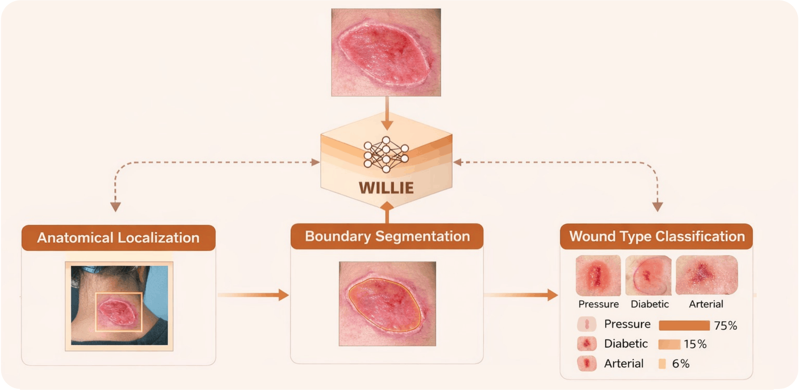

# WILLIE

**A Unified Vision-Transformer Framework and Benchmark for
Wound Classification, Segmentation, and Localization**

Gopi Trinadh Maddikunta · Peizhu Qian
Qian Group, University of Houston

[](https://www.mlforhc.org/)
[](LICENSE)
[](https://www.python.org/)
[](https://pytorch.org/)

[](https://huggingface.co/QianGroup/willie-weights)
[](https://huggingface.co/QianGroup/willie-benchmark)

</div>

---

## At a glance

| | |
|:--|:--|
| **Tasks** | Classification · Segmentation · Localization |
| **Datasets** | FUSeg · AZH · Medetec — unified into one 5-class taxonomy |
| **Scales** | MINI 34.3M · BASE 520.4M · XL 762.5M |
| **Headline** | 91.88% Acc · 91.41% Dice · 96.23% AP@0.5 |
| **Weights** | [🤗 willie-weights](https://huggingface.co/QianGroup/willie-weights) |
| **Benchmark** | [🤗 willie-benchmark](https://huggingface.co/QianGroup/willie-benchmark) |

---

## Model zoo

Hosted on the Hugging Face Hub:
**[QianGroup/willie-weights](https://huggingface.co/QianGroup/willie-weights)**

| Model | Params | Folds | Files |
|:--|--:|--:|:--|
| [WILLIE-MINI](https://huggingface.co/QianGroup/willie-weights/tree/main/mini) | 34.3M | 5 | `mini/willie_mini_fold{0-4}_best.pt` |
| [WILLIE-BASE](https://huggingface.co/QianGroup/willie-weights/tree/main/base) | 520.4M | 5 | `base/willie_base_fold{0-4}_best.pt` |
| [WILLIE-XL](https://huggingface.co/QianGroup/willie-weights/tree/main/xl) | 762.5M | 5 | `xl/willie_xl_fold{0-4}_best.pt` |
| [Decoders](https://huggingface.co/QianGroup/willie-weights/tree/main/decoders) | — | — | fine-tuned MedSAM / SAM2 mask decoders |

```python
import torch
from huggingface_hub import hf_hub_download

path  = hf_hub_download("QianGroup/willie-weights", "xl/willie_xl_fold0_best.pt")
ckpt  = torch.load(path, map_location="cpu")
state = ckpt.get("model_state_dict", ckpt)   # XL ships as a bare state_dict
model.load_state_dict(state)
model.eval()
```

Preprocessing: ImageNet normalization; resize 256→224 (MINI) or 420→378
(BASE/XL). Reported numbers use the fold ensemble — a single fold scores lower.

---

## Datasets

Three public wound datasets. **Images are governed by their original licences
and are not redistributed here.**

| Dataset | Source | Notes |
|:--|:--|:--|
| **FUSeg** | [fusc.grand-challenge.org](https://fusc.grand-challenge.org) | Requires the challenge data-use agreement |
| **AZH** | [uwm-bigdata](https://github.com/uwm-bigdata) | AZH Wound and Vascular Center |
| **Medetec** | [medetec.co.uk](http://www.medetec.co.uk) | Own terms of use |

Split definitions are on the Hub:
**[QianGroup/willie-benchmark](https://huggingface.co/QianGroup/willie-benchmark)**

<details>
<summary><b>Expected directory layout</b> — 3,535 files</summary>

```
data/
├── FUSeg/
│   ├── train/images/   610      train/labels/   610
│   ├── val/images/     400      val/labels/     400
│   └── test/images/    200      (no public labels)
├── AZH/
│   ├── train/   BG 75 · diabetic 139 · "no wound" 75 ·
│   │            pressure 100 · surgical 122 · venous 185
│   └── test/    BG 25 · diabetic 46 · "no wound" 25 ·
│                pressure 34 · surgical 42 · venous 62
└── Medetec/
    ├── diabetic/   48        pressure/  170
    └── toes/       34        venous/    133
```

The AZH class folder `no wound` contains a space. Keep it.
`verify_data.py` reports per-directory counts and names any missing file.

</details>

---

## Repository structure

| Notebook | Purpose |
|:--|:--|
| `01_WILLIE_DataForge.ipynb` | Data preparation, cleaning, split generation |
| `02_WILLIE_DetectionEngine.ipynb` | Detection baseline pipeline |
| `03_WILLIE_Cls_Baselines.ipynb` | Classification baselines |
| `04_WILLIE_Seg_Baselines.ipynb` | Segmentation baselines |
| `WILLIE_SAM2_vs_MedSAM.ipynb` | SAM2 vs MedSAM comparison |
| `WILLIE_MINI.ipynb` | MINI (34.3M) |
| `07_WILLIE_BASE.ipynb` | BASE (520.4M) |
| `08_WILLIE_XL.ipynb` | XL (762.5M) |
| `09_WILLIE_Scaling_Analysis.ipynb` | Scaling behaviour across tasks |
| `10_WILLIE_Cls_Comparison.ipynb` | Classification comparison |
| `11_WILLIE_Det_Comparison.ipynb` | Detection / localization comparison |
| `12_WILLIE_All_Figures_Tables.ipynb` | Figures and tables |

| Directory | Contents |
|:--|:--|
| `data/processed/index/` | Authoritative index and split definitions |
| `04_Manifests_and_Splits/` | Per-task manifests |
| `Figures/` | Generated figures |
| `Tables/` | Generated tables |
| `07_Evaluation_Results/` | Per-run evaluation outputs |
| `08_SAM2_Generated_Masks/` | SAM2-generated masks |
| `09_Detection_Predictions/` | Detection predictions |
| `ablations/` | Component ablation scripts |

Manifest paths are relative to the repository root.

---


## Reproducing the paper

1. Set up the `wound` environment.
2. Obtain the datasets and place them per the layout above.
3. Run `01_WILLIE_DataForge.ipynb` to build and verify the splits.
4. Run `06`–`08` for MINI / BASE / XL.
5. Run `09`–`13` to regenerate the tables and figures.

BASE and XL need multi-GPU hardware. MINI is the single-GPU entry point. For
inference only, download the released weights instead of training.

---

## Two findings

**1. Segmentation-derived localization beats dedicated detectors.**

Deriving the wound bounding box from the predicted segmentation mask outperformed
RT-DETR and YOLO baselines trained directly for detection.

<div align="center">
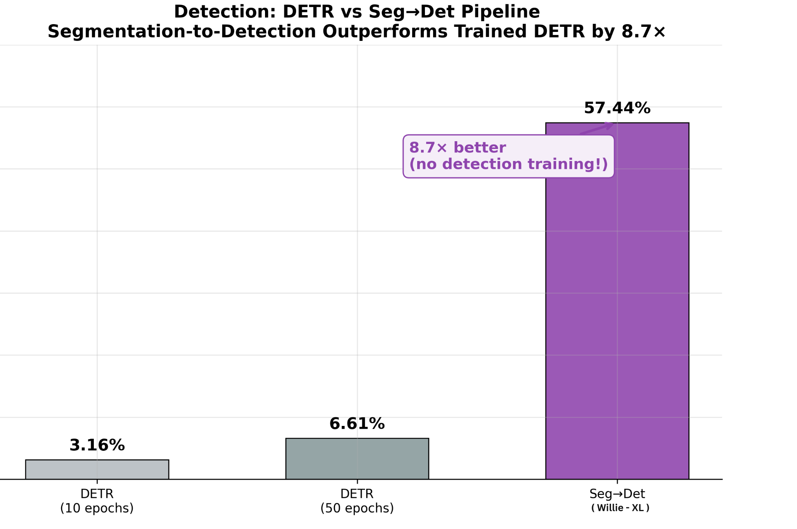
</div>

**2. Scaling is task-dependent.**

Capacity does not help uniformly. Segmentation gains substantially from scale;
classification saturates. This argues against choosing a single capacity for a
multi-task wound pipeline.

<div align="center">
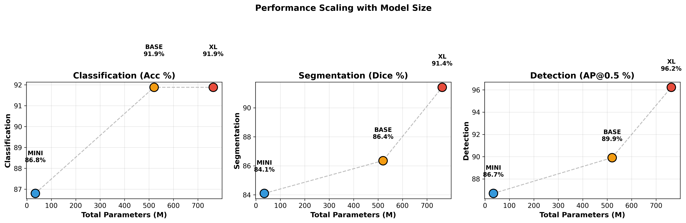
</div>

---

## Architecture

A shared encoder feeds three task heads over a single 5-class taxonomy
(`diabetic`, `pressure`, `surgical`, `venous`, `no_wound`). Capacity is added by
stacking backbones rather than widening a single one.

<div align="center">
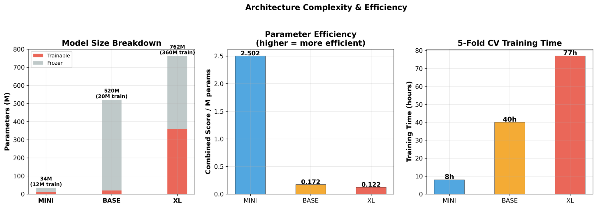
</div>

| Scale | Params | Backbones | Input |
|:--|--:|:--|:--|
| **MINI** | 34.3M | DINOv2-S + FPN | 224×224 |
| **BASE** | 520.4M | + ConvNeXt-L (dual) | 378×378 |
| **XL** | 762.5M | + SAM2-Hiera-L (triple) | 378×378 |

Components: F²DCA, WA-CSA, MoE-8, WTCS, WBRN. Definitions and the component
ablation are in the paper.

---

## Results

Test-set results, 5-fold ensemble with test-time augmentation.

| Task | Metric | WILLIE |
|:--|:--|--:|
| Classification | Accuracy | **91.88%** |
| Segmentation | Dice | **91.41%** |
| Localization | AP@0.5 | **96.23%** |

<div align="center">
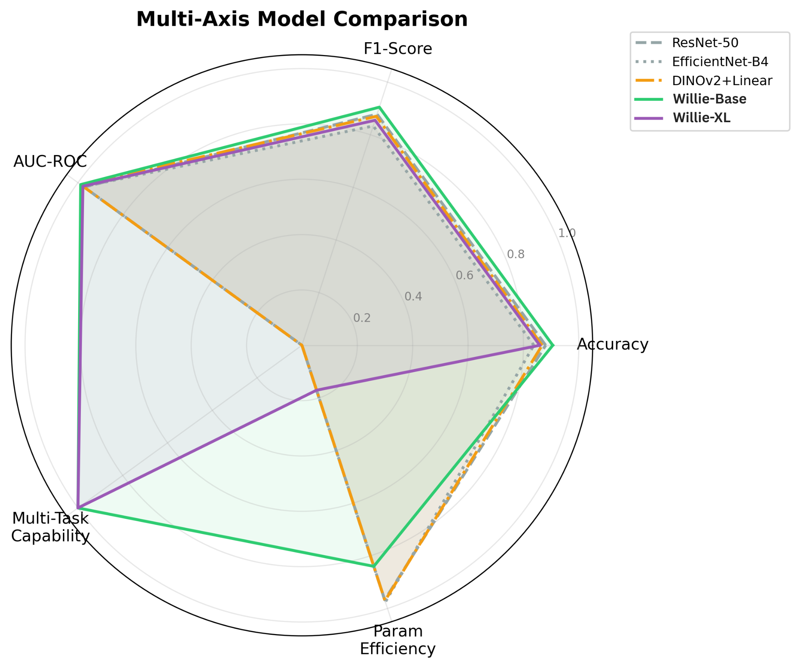
</div>

### Against baselines

<table>
<tr>
<td width="50%">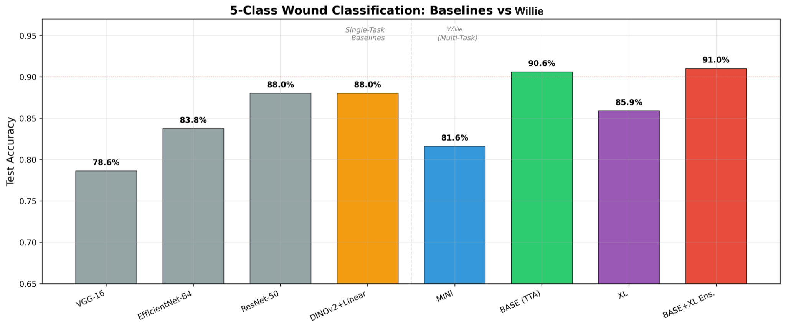</td>
<td width="50%">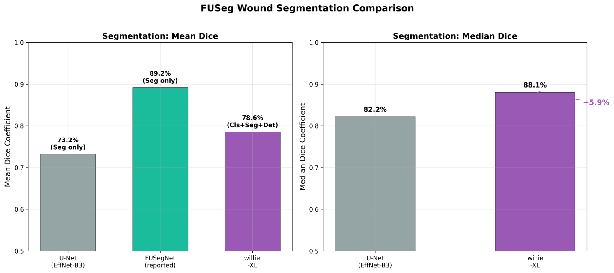</td>
</tr>
<tr>
<td align="center"><em>Classification vs ResNet-50, VGG-19, EfficientNet-B4, DINOv2+Linear</em></td>
<td align="center"><em>Segmentation vs U-Net, SAM2.1, MedSAM</em></td>
</tr>
</table>

### Accuracy per parameter

<div align="center">
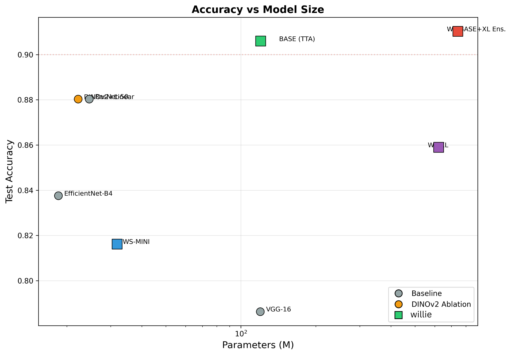
</div>

### Cross-validation

Mean ± std over 5 folds. Lower than the headline numbers because the headline
uses the held-out test split with TTA and fold ensembling.

| Scale | Cls Acc | Seg Dice | Det AP@0.5 | Combined |
|:--|:--|:--|:--|:--|
| MINI | 86.4 ± 1.2 | 83.6 ± 1.7 | 85.4 ± 2.7 | 85.0 ± 1.2 |
| BASE | 88.5 ± 2.0 | 87.5 ± 1.0 | 85.9 ± 4.5 | 87.6 ± 1.8 |
| XL | — | 91.5 ± 1.1 | — | — |

<div align="center">

</div>

### Ablation

<div align="center">
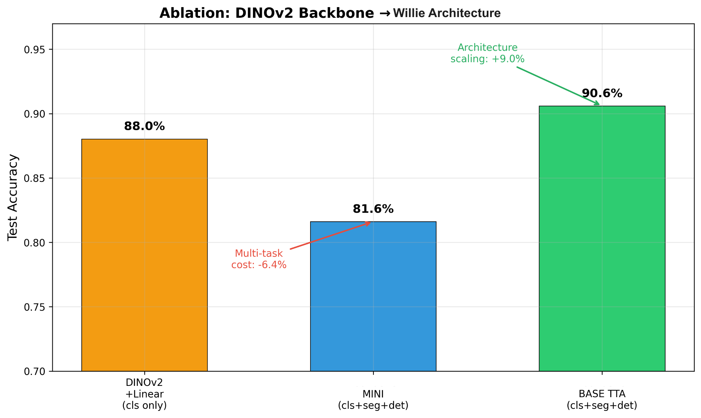
</div>

**Component-level.** BASE variant, 60 epochs, identical hyperparameters,
removing one component at a time.

| Configuration | Accuracy | Macro-F1 | AUC | Δ Acc |
|:--|--:|--:|--:|--:|
| **Full WILLIE-BASE** | **86.75%** | **85.80%** | **0.957** | — |
| − Multi-scale extraction (P4 only) | 83.76% | 82.44% | 0.941 | −2.99 |
| − WA-CSA (standard FPN only) | 84.19% | 83.10% | 0.948 | −2.56 |
| − Differential LR (uniform LR) | 84.62% | 83.50% | 0.946 | −2.13 |
| − MoE (single MLP head) | 85.47% | 84.62% | 0.952 | −1.28 |
| − WTCS (no FiLM conditioning) | 85.90% | 84.95% | 0.954 | −0.85 |
| Frozen backbone (no fine-tuning) | 79.49% | 78.20% | 0.921 | −7.26 |

Multi-scale extraction across four DINOv2 blocks is the largest single
contributor, followed by WA-CSA's wound-aware spatial gating. WTCS contributes
least to classification — its benefit is primarily to segmentation, since the
FiLM conditioning pathway runs from the classification head into the
segmentation decoder.

<div align="center">
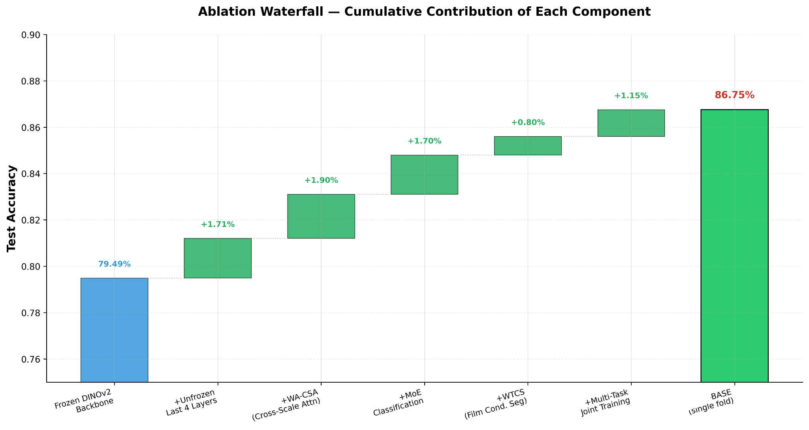
</div>

**Backbone-level.** Each row adds to the previous.

| Configuration | Cls Acc | Seg Dice | Det AP@0.5 | Added |
|:--|--:|--:|--:|:--|
| DINOv2 + Linear | 86.75 | — | — | frozen features |
| MINI (DINOv2-S) | 86.8 | 84.1 | 85.6 | MoE-8, seg/det heads |
| BASE (+ ConvNeXt-L) | 91.88 | 86.36 | 89.91 | ConvNeXt, F²DCA |
| **XL (+ SAM2-Hiera-L)** | **91.88** | **91.41** | **96.23** | SAM2, seg-specific |

<div align="center">
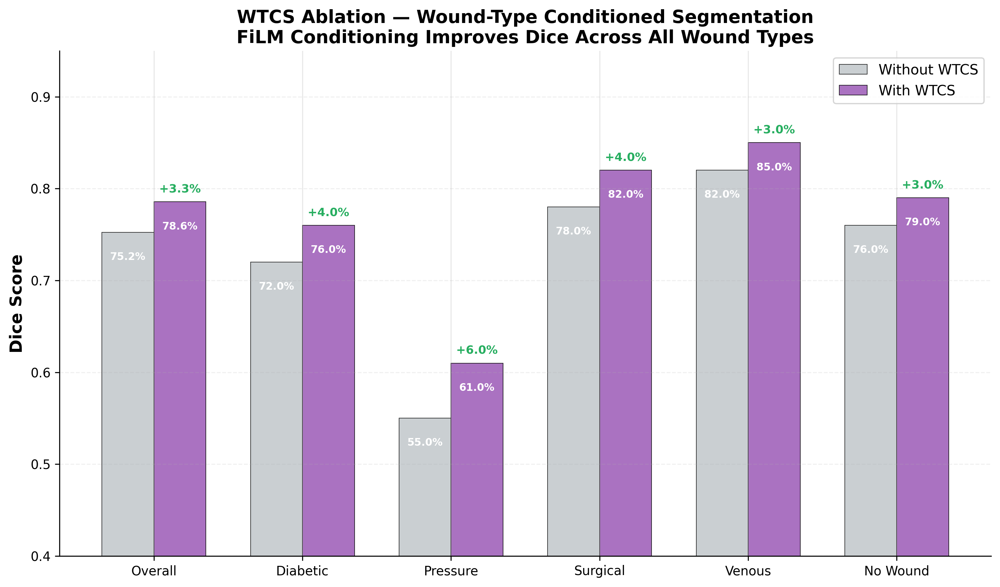
</div>

> Several component-level effects fall within cross-validation noise. Read the
> paper's ablation section before attributing gains to individual components.
> Full 5-fold ablation scripts are in [`ablations/`](ablations/) covering
> `full`, `no_F2DCA`, `no_WACSA`, `no_MoE`, `no_WTCS` and `backbone_only`.

All generated tables are in [`Tables/`](Tables/); all figures in
[`_Figures/`](Figures/).

---

## Quick start

```bash
git clone https://github.com/Qian-Group-HRI/Willie.git
cd Willie

conda create -n wound python=3.10
conda activate wound
pip install -r requirements.txt
```

Obtain the datasets (below), then:

```bash
python verify_data.py
```

```
TOTAL                      3535        0
All referenced files present. The splits will reproduce.
```

---

## Provenance

Outputs stored in these notebooks were produced on the University of Houston
*carya* cluster during the study. Three cosmetic edits were made for release:

- absolute cluster paths rewritten to repository-relative form
- embedded figure payloads removed from notebook outputs
- the model name updated from its development name

**No numeric result was altered.** The notebooks have not been re-executed after
this cleanup, so stored metrics are a record of the original runs rather than the
output of a fresh execution. Execution counts in some notebooks are
non-sequential, reflecting interactive development.

---

## Citation

```bibtex
@inproceedings{willie2026,
  title     = {WILLIE: A Unified Vision-Transformer Framework and Benchmark
               for Wound Classification, Segmentation, and Localization},
  author    = {Maddikunta, Gopi Trinadh and Qian, Peizhu},
  booktitle = {Proceedings of the Machine Learning for Healthcare Conference (MLHC)},
  year      = {2026}
}
```

Please also cite FUSeg, AZH and Medetec per their own requirements.

---

## Licence

Code released under the [MIT Licence](LICENSE). The wound datasets are **not**
covered by this licence and remain subject to their original terms.

---

<div align="center">

**Qian Group**, University of Houston · Advisor: Dr. Peizhu Qian
Computation performed on the UH *carya* cluster.

</div>
